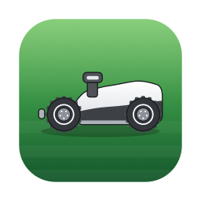
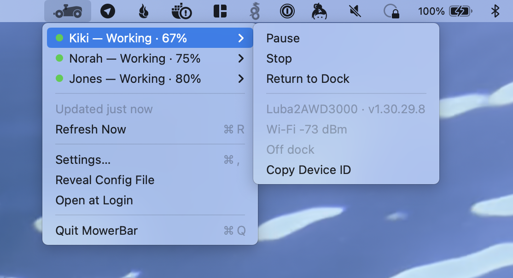
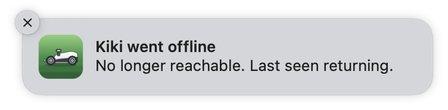
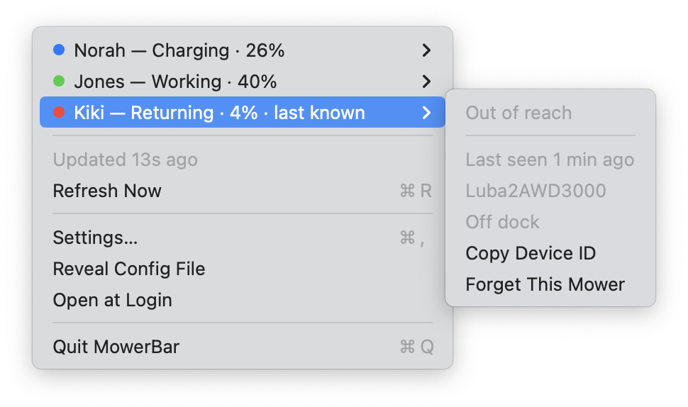
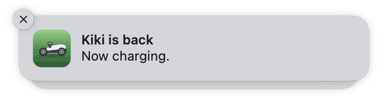
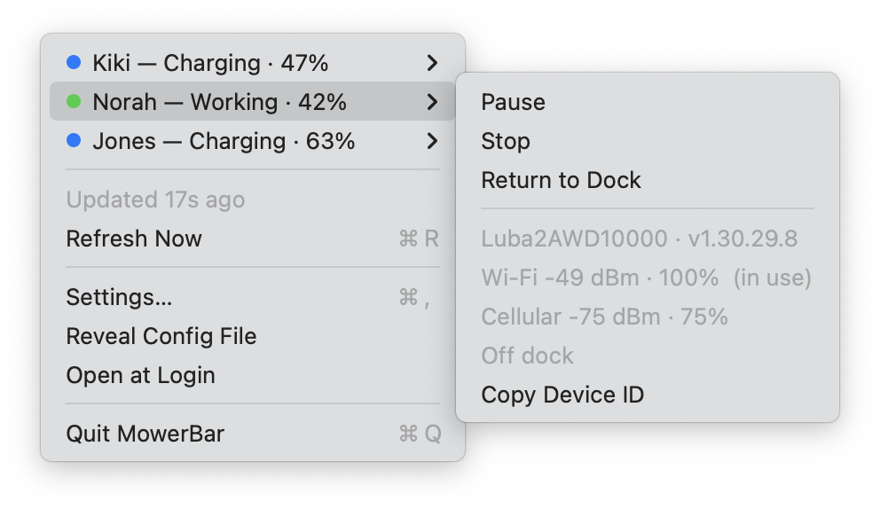

<div align="center">



# MowerBar

**Your robot mowers in the macOS menu bar.**

Status at a glance, a red dot when something stalls, and the handful of
commands that actually make sense right now.

<sub>macOS 13+ · Apple Silicon &amp; Intel · native Swift + AppKit · zero dependencies · MIT</sub>



<sub>Three mowers, three states, three colours — and only the commands each one<br>
can actually accept right now. A mower on its way back gets **Cancel Return**;<br>
it is never offered **Start**.</sub>

</div>

---

## Why

I have a fleet of three Luba 2 mowers working their way around the property, and
too often I noticed one had got stuck a little too late — hours of good mowing
weather, gone, because nobody was looking.

So: a menu bar icon that shows the mowers and their status, and **tells me when
one gets stuck**. Pause, stop, send it back to the dock — straight from the menu
bar, without opening an app.

Here is a real one, start to finish. Kiki was on her way back to the dock at 4%
battery when she dropped off the network:

<div align="center">



<sub>This is the one that matters. It arrives when it happens,<br>not when you next think to look.</sub>

</div>

She does not vanish from the menu while she is gone. She keeps her row, in red,
still showing what she was last seen doing — because "was returning at 4%" is a
very different problem from "is idle":

<div align="center">



<sub>Live mowers first, out-of-reach ones after. No commands are offered<br>to a mower that cannot hear them.</sub>

</div>

And then she made it home:

<div align="center">



<sub>Which means you can stop thinking about it.</sub>

</div>

A mower stuck mid-lawn reads **"Kiki is stuck — Paused mid-job, off the dock"**.
One settling onto its dock to charge says nothing at all, because nothing is wrong.

It uses the **official Mammotion API**. Not affiliated with Mammotion. Getting an
API key is free — [instructions below](#get-your-api-credentials).

---

## 🐉 Here be dragons

Read this bit. Really.

- **This software drives real machinery.** A menu click can start, stop or send a
  ~15 kg robot across your lawn while you are not looking at it. There is no
  confirmation dialog — deliberate, but it means a stray click acts immediately.
- **Not affiliated with, endorsed by, or supported by Mammotion.** No relationship
  with the manufacturer whatsoever. "Mammotion", "Luba" and "Yuka" are their
  trademarks, used here only to say which hardware this talks to.
- **Weekend-project maturity.** Written fast, tested against exactly one account
  and three mowers. No test suite. Expect rough edges.
- **Provided as-is, no warranty** (see [LICENSE](LICENSE)). If it stops your mow
  mid-lawn, drives into a flowerbed, or misses an alert you were counting on,
  that is on you.
- **Your credentials sit in a plaintext file** (`0600`, in Application Support).
  That is the trade-off for "just edit the JSON". If that is not acceptable to
  you, move them into the Keychain — it is a contained change.
- The API is rate-limited. Polling harder than the default will not end well.

It has run happily for its author. That is the entire body of evidence.

---

## What it is

A menu bar extra — the icon lives in the *menu bar*, and those icons are called
**status items** or **menu bar extras**. It polls your fleet every five minutes
and puts each mower one click away. No Dock icon, no window.

It uses the **official [Mammotion Developer API](https://developer.mammotion.com/)** —
the public, documented one. Nothing is reverse engineered, no app traffic is
intercepted, no cloud account is proxied through a third party. You bring your own
credentials and talk to Mammotion directly.

## What it can do

- List every mower on your account by nickname, with **status, battery and charge state**.
- Send **Start, Pause, Resume, Stop, Return to Dock, Cancel Return** — and only
  the ones the mower can actually accept right now. A paused mower offers Resume,
  never Start.
- Start a **saved task by name**, if you have plans set up in the Mammotion app.
- **Badge the menu bar red** when a mower is stuck, faulted or offline — and
  *not* when it is simply charging on its dock, which the API also calls "Paused".
- **Notify** on the transitions worth interrupting for — stuck, faulted, went
  offline, and optionally recovered. Transitions only: a stuck mower nags once,
  not every five minutes. A change you asked for yourself stays quiet, and a
  mower settling onto its dock to charge says nothing at all.
- **Remember mowers.** One that drops off the device list keeps its place in the
  menu carrying its last known state, rather than silently vanishing.
- Show firmware version, dock state, and **both radios' signal** — Wi-Fi and
  cellular, each with a rough percentage, marking which one is actually in use.
- Open at login, and answer a `mowerbar://` URL scheme for scripting.

<div align="center">



<sub>Signal is reported for both radios whether or not they are carrying traffic.<br>
Knowing a mower at the edge of Wi-Fi still has 4G to fall back on is<br>
the difference between "it might drop off" and "it will".</sub>

</div>

## What it cannot do

- **No map, no zones, no scheduling.** Use the Mammotion app for anything spatial.
  This is a status-and-simple-commands tool.
- **No task creation.** It can start a saved plan by name; it cannot make one.
- **No live position, no camera, no path history.** The API does not expose them.
- **No satellite count or RTK fix quality.** Not in any pollable endpoint. The
  subscription API lists a `LOC_SRC` property, but the REST spec documents no way
  to receive those events — no webhook, no MQTT endpoint.
- **No mowing parameters** — height, speed, pattern. App only.
- **No RTK base station management.** They appear on the account and are filtered
  out; they carry no status, battery or plan.
- **No real-time push.** It polls. A change shows up within one poll interval
  (5 min by default), or immediately if you open the menu or hit Refresh.
- **No pre-2025 models.** Per Mammotion, the Developer API only covers models
  released in 2025 onward.
- **macOS only.** No iOS/iPadOS build.

---

## Get your API credentials

You need your own. They are per-account and they *are* your account identity —
this app ships with none, and you should never paste someone else's.

1. Sign in at **[developer.mammotion.com](https://developer.mammotion.com/)** with
   the same Mammotion account your mowers are on.
2. Follow **[Create Credentials](https://developer.mammotion.com/docs/create-credentials)**:
   click *Create Credentials*, fill in what it asks, confirm.
3. **Copy both values immediately.** The secret is shown once, at creation time.
   Lose it and you have to reset the credential, which invalidates the old one.
4. Make sure your mowers are already on that account in the Mammotion app and that
   a map/task plan works there — see
   [Pre-operation](https://developer.mammotion.com/docs/pre-operation).

Then paste both into **Settings…** in the menu and press **Sign In**.

> Treat the client secret like a password. Anyone holding it can start and stop
> your mowers.

## Install

Grab `MowerBar.zip` from [Releases](https://github.com/WietseWind/MowerBar/releases),
unzip, drag `MowerBar.app` to `/Applications`, open it.

Releases are **universal** — one download runs natively on both Apple Silicon and
Intel — signed with a Developer ID and notarized by Apple, so they open without a
Gatekeeper fight. On first launch there are no credentials and it says
so — open **Settings…**, paste, **Sign In**.

## Build from source

```bash
git clone git@github.com:WietseWind/MowerBar.git
cd MowerBar
./build.sh && open build/MowerBar.app
```

That produces a universal (arm64 + x86_64), ad-hoc signed build — fine locally.
Add `--native` to build only for the machine you are on, which is quicker while
iterating. For something you can hand to
someone else:

```bash
xcrun notarytool store-credentials "notarytool" --apple-id you@example.com --team-id TEAMID

./build.sh --sign "Developer ID Application: Your Org (TEAMID)" \
           --notarize notarytool \
           --dest ~/Desktop
```

## Authentication, honestly

There is **no browser sign-in**, because the API has no such thing.
`https://id.mammotion.com/oauth2/token` accepts exactly two grant types:
`client_credentials` and `refresh_token`. No `authorization_code`, no authorize
URL, no redirect URI. So "sign in" means pasting your credentials; the app
exchanges them for a token (~15 days), caches it, and renews it with the refresh
token before expiry. A `401` clears the token and re-authenticates once.

`mowerbar://` is registered as a URL scheme, but *not* as an OAuth callback —
there is nothing to call back to.

## Configuration

`~/Library/Application Support/MowerBar/config.json`, created on first run,
`0600`, reachable via **Reveal Config File** in the menu.

| Key | Default | What it does |
|---|---|---|
| `clientId` / `clientSecret` | *(empty)* | Your Mammotion Developer credentials |
| `pollMinutes` | `5` | How often the fleet is polled |
| `alertOnPaused` | `true` | Treat a paused mower as a menu bar alert |
| `rememberDays` | `30` | How long a vanished mower stays in the menu |
| `lastKnownMinutes` | `10` | How long its last status still counts as meaningful |
| `notifyOnChange` | `true` | Notify on pause / fault / offline |
| `notifyOnRecovery` | `true` | Also notify when it picks back up |
| `menuBarIconHeight` | `15` | Menu bar icon height, in points |
| `authBaseURL` / `apiBaseURL` | Mammotion | Endpoint overrides |
| `acceptLanguage` | `en-US` | `Accept-Language` sent to the API |

Missing keys fall back to defaults, so trim the file to just what you want to
change. `token.json` (cached OAuth token) and `mowers.json` (remembered fleet)
live alongside it. **All three are gitignored and none should ever be shared.**

### Commands offered per status

| Status | Offered |
|---|---|
| Standby | Start Mowing, Return to Dock *(only off the dock)*, Start Task ▸ *(if plans exist)* |
| Working | Pause, Stop, Return to Dock |
| Paused *(off dock — stuck)* | Resume, Stop, Return to Dock |
| Charging / Docked | Resume, Stop |
| Returning | Cancel Return, Stop |
| Mapping / Updating / Abnormal / Offline | nothing |
| out of reach (remembered) | nothing |

`START` needs a task name and only works with saved plans. With no plans,
`CMD_START` ("Start Mowing") is the one that works.

### Dots

| | Meaning |
|---|---|
| 🟢 | Working or Returning |
| 🔵 | Charging — on the dock, topping up, nothing to do |
| ⚪ | Standby, Mapping, Updating |
| 🔴 | **Stuck** — paused mid-job and off the dock — or Abnormal, Offline, out of reach |

The menu bar badge goes red for any red row.

### Paused is two different situations

The API reports `Paused` for a mower stalled in the middle of the lawn *and* for
one sitting on its dock charging. Those could not be more different — one costs
you an afternoon, the other is the machine doing its job. `chargeStatus` is the
only field that separates them, so MowerBar splits them:

| status | chargeStatus | shown as | dot |
|---|---|---|---|
| `Paused` | `0` (off dock) | **Paused** — stuck, needs you | 🔴 |
| `Paused` | non-zero (on dock) | **Charging** (or **Docked** at 100%) | 🔵 |

Only the first raises the menu bar badge, and only the first sends a notification.

### Remembered mowers

A mower that drops off the account's device list is not the same as a mower that
no longer exists. It keeps its row, showing what it was last seen doing:

```
Kiki — Working · 89% · last known        (submenu: "Last seen 4 min ago")
```

Past `lastKnownMinutes` that reading is too old to mean anything and it reads
`Not reachable`. Past `rememberDays` it drops out of memory entirely. **Forget**
it sooner from Settings or its own submenu — if it is still reachable it comes
straight back on the next sync. No commands are ever offered from a remembered
state.

<div align="center">


</div>

## URL scheme

```
mowerbar://refresh
mowerbar://settings
mowerbar://test-notification
mowerbar://mower/<deviceId>/<start|pause|resume|stop|return|cancel_return>
```

Device IDs come from **Copy Device ID** in a mower's submenu.

## CLI

The app binary doubles as a status dump, driving the same code path the menu does
— so what you see here cannot drift from what the menu shows:

```bash
/Applications/MowerBar.app/Contents/MacOS/MowerBar --status
```

```
Kiki           Paused · 89%               attention  Resume, Stop, Return to Dock
Norah          Standby · 100%             idle       Start Mowing
Jones          Working · 64% · last known alert      —  (last seen 3 min ago)
```

`MOWERBAR_SUPPORT_DIR=/tmp/whatever` points a run at a throwaway state directory,
handy for poking at behaviour without touching your real config. (`$HOME` does
*not* work for this — Application Support resolves via `getpwuid`.)

## Troubleshooting

**No notifications.** The menu grows a *"Notifications are off — Turn On…"* row
when macOS is refusing them, deep-linking to the right settings pane.
`mowerbar://test-notification` fires a test and tells you why if nothing appears.
Note that a self-built, ad-hoc signed app gets a new code signature on every
rebuild and macOS may reset the grant each time. Release builds are stable.

**"Apple could not verify…"** means an unnotarized build. Use the release
artifact, or notarize your own.

**Mowers missing.** Only 2025-and-newer models are covered by the Developer API,
and the mower has to be on the same account the credentials came from.

**Cannot paste into Settings (1.1.3 and earlier).** A menu bar app has no menu bar
of its own, and macOS routes ⌘V through the main menu — with none installed, paste
was never delivered anywhere. Fixed in 1.1.4. On older builds the workaround is to
edit `config.json` directly.

## How it works

| File | Role |
|---|---|
| `AppInfo.swift` | product identity — name, bundle id, URL schemes |
| `MammotionAPI.swift` | token lifecycle, endpoints, 401 retry |
| `FleetMonitor.swift` | polling loop, fleet snapshot, remembering, commands |
| `Models.swift` | API shapes, status enum, **which actions each status allows** |
| `AppDelegate.swift` | status item and menu, updated in place |
| `Notifier.swift` | notification permission, transition → message mapping |
| `MowerIcon.swift` | the mower, drawn as vector art (menu bar + app icon) |
| `Config.swift` | JSON config, token cache, remembered fleet |
| `SettingsWindow.swift` | credentials, polling, memory, notification toggles |

Two details worth knowing before you touch it:

- **The menu is built once and updated in place**, behind per-row signatures. A
  full rebuild on every poll makes the panel flicker, jump width, and collapse
  whatever submenu you had open. Same for the menu bar image — only reassigned
  when it would actually differ.
- **The icon is vector, not a bitmap.** A flat template silhouette for the menu
  bar (so macOS tints it for light/dark) and a shaded rendering for the app icon:
  same geometry, two renderers.

## API notes

From the live spec at `https://api-open.mammotion.com/api-docs`, which differs
from the older `device_swagger.json` linked off the docs site — that one points at
a test host and per-action endpoints that no longer exist.

- `GET /v1/mowers` — id, name, nickname, model, icon, online
- `GET /v1/mower/{deviceId}` — adds version, status, batteryLevel, chargeStatus, network
- `GET /v1/mower/{deviceId}/plan` — saved tasks
- `POST /v1/mower/action` — `{deviceId, action, params:{taskName}}`

`network` reports **both** radios on every call, regardless of which is carrying
traffic — `wifiAvailable`/`wifiRssi` and `cellularAvailable`/`cellularRssi`, with
`usedNetwork` naming the active one (`1` Wi-Fi, `2` cellular). The percentages
MowerBar shows are a rule of thumb, linear over a 40 dB span (−50…−90 for Wi-Fi,
−65…−105 for cellular), which is why the dBm figure stays next to them.

`chargeStatus` is documented as `1` charging / `0` not, but `2` also occurs — and
`2` has been observed at both 17% and 100% battery, so it does not mean "full".
Only zero versus non-zero is treated as meaningful: `0` is off the dock, anything
else is on it. That single bit is what separates a stuck mower from a charging
one, since both report `Paused`.

## Licence

[MIT](LICENSE) © Wietse Wind

Not affiliated with Mammotion. Trademarks belong to their respective owners.
